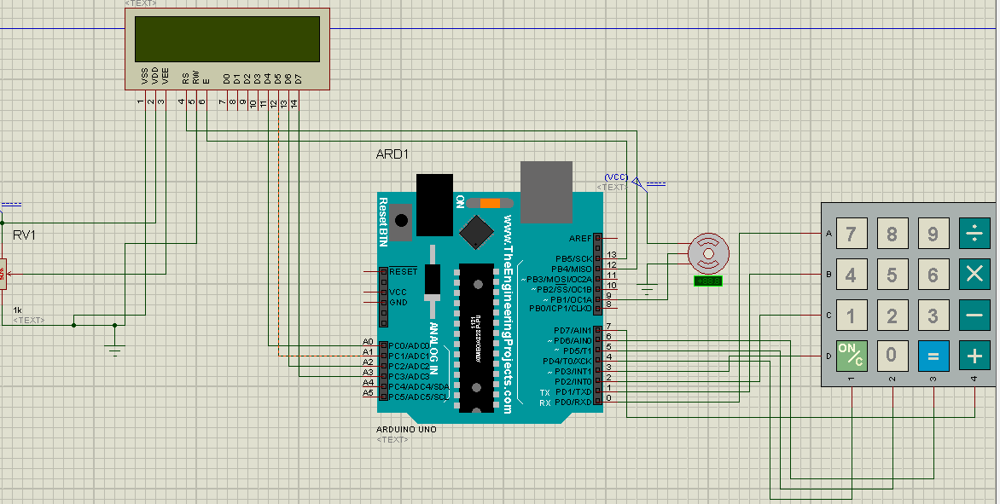
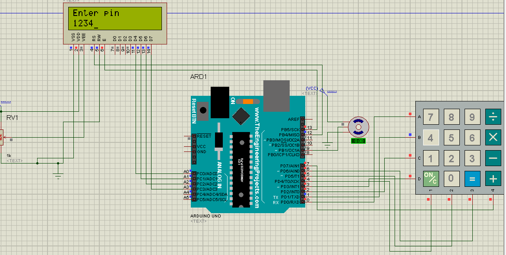
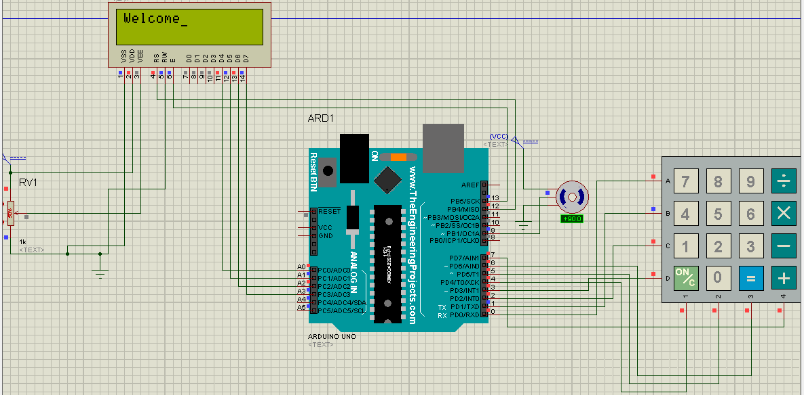
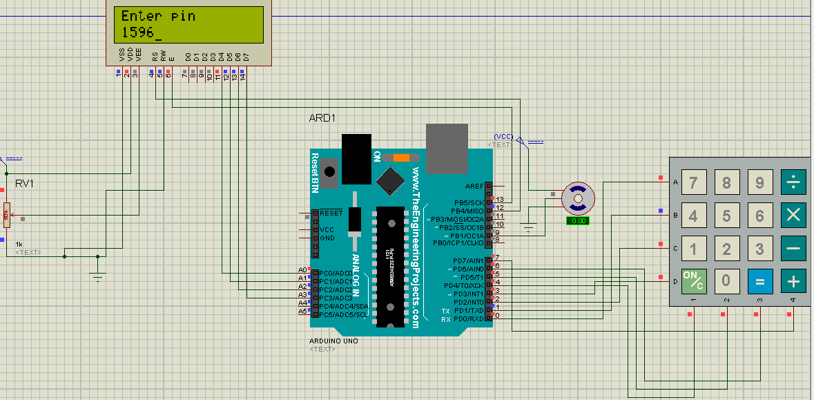
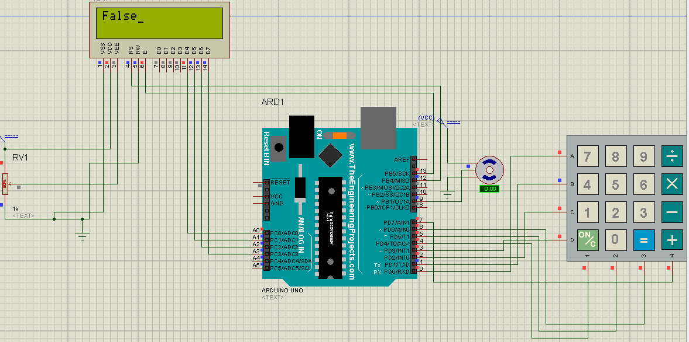

# Door Lock System Arduino

## Objective
The purpose of this project is to design a lock door system which uses keypad for entering the password, and lcd to print the feedback if the password is true or false and a servo motor to rotate the door.
The user will enter his password which consists of four predefined characters. If the password is true the door will open, otherwise it won’t.

## Equipment
-	Atmel Studio
-	Proteus
-	Arduino Uno
-	Breadboard 
-	Wires
-	Servo motor
-	LCD lm016
-	USB Arduino jack
-	Keypad
## Description
This project will use keypad for the user to enter 4 keys to unlock the door.
After powering on the Arduino, the lcd will show “Enter pin”, and the MCU will start scanning through the keypad for four strokes. The Arduino will then compare the entered password with the real one which is “1234”; if it is true the lcd will print “Welcome” and the servo will rotate by 90(door unlock), wait for few seconds, then return it back to 0. If it is false, the lcd will show “false”. Then the Arduino will ask for the password again and scan the keypad for a password.

Proteus diagram:

## Results
Proteus simulation.
When entering the right password, the lcd will print welcome and the servo will rotate by 90 degrees.

When entering false pin:

